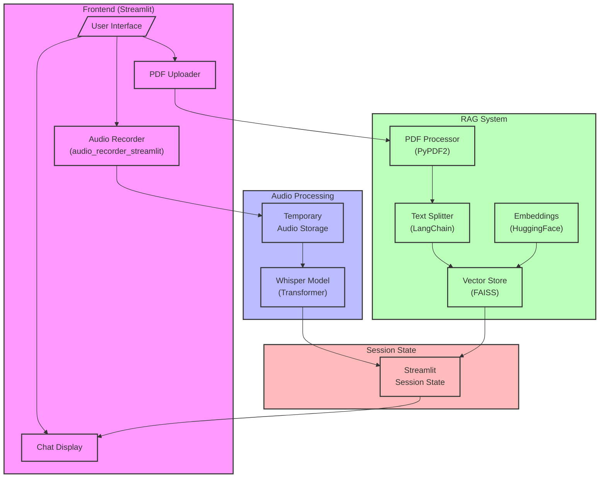

# Precautions
This is a complete demo application.
In general, text input is more intuitive to use than voice input.

# Voice Input RAG Chatbot Architecture

## Architecture


## Main Components

### Frontend (Streamlit)
- **User Interface**: Main application interface built with Streamlit
- **Audio Recorder**: Handles voice input using audio_recorder_streamlit
- **PDF Uploader**: Manages PDF file uploads
- **Chat Display**: Shows conversation history and RAG results

### Audio Processing
- **Whisper Model**: OpenAI's Whisper model for speech-to-text conversion
- **Temporary Audio Storage**: Temporary storage for audio files before processing

### RAG System
- **PDF Processor**: Extracts text from PDF files using PyPDF2
- **Text Splitter**: Splits text into manageable chunks using LangChain
- **Vector Store**: FAISS vector database for similarity search
- **Embeddings**: HuggingFace embeddings for text vectorization

### Session State
- **Streamlit Session State**: Manages application state and user session data

## Data Flow

1. User Input Flow:
   - User uploads PDF or records audio through the UI
   - Audio is temporarily stored and processed by Whisper
   - Transcribed text is stored in session state

2. PDF Processing Flow:
   - PDF text is extracted and split into chunks
   - Chunks are converted to embeddings
   - Embeddings are stored in FAISS vector store

3. Query Flow:
   - Transcribed audio is used as query
   - Vector store performs similarity search
   - Results are displayed in chat interface

## Technical Details

### Key Technologies
- **Frontend**: Streamlit
- **Speech-to-Text**: Whisper (Transformers)
- **Vector Search**: FAISS
- **Text Processing**: LangChain
- **PDF Processing**: PyPDF2
- **Embeddings**: HuggingFace

### State Management
- Uses Streamlit's session state for:
  - Recording status
  - Chat history
  - PDF processing status
  - RAG system state

### Optimization Features
- Async processing for audio handling
- Cached model loading
- Temporary file cleanup
- Automatic silence detection

# Setup Guide for Voice RAG Chatbot

## Prerequisites
- Python 3.11 or later
- pip (Python package installer)
- Git (for cloning the repository)

## Project Setup

### 1. Create and Activate Virtual Environment

For Unix/macOS:
```bash
python3.11 -m venv voice
source voice/bin/activate
```

For Windows:
```bash
python3.11 -m venv voice
.\voice\Scripts\activate
```

### 2. Install Dependencies

Install required packages:
```bash
pip install --upgrade pip
pip install -r requirements.txt
```

Note: Some packages might require additional system dependencies:
- PyAudio: Required for audio recording functionality
- FAISS: Required for vector similarity search
- Torch: Required for Whisper model

### 3. Running the Application

Start the Streamlit server:
```bash
python3.11 -m streamlit run app/main.py
```

### 4. Accessing the Application

Access the application through your web browser:
- URL: http://localhost:8501
- Default port: 8501 (can be changed if needed)

## Usage Notes

1. **PDF Upload**: 
   - Supports PDF files only
   - Maximum file size depends on your Streamlit configuration

2. **Audio Recording**:
   - Requires microphone access permission in browser
   - Uses WebRTC for audio capture
   - Auto-processes after 1.5 seconds of silence

3. **Troubleshooting**:
   - If audio recording doesn't work, check browser permissions
   - For PDF processing issues, ensure the file is text-based and readable
   - GPU acceleration requires CUDA-compatible device for Torch

## System Requirements

- **Memory**: Minimum 4GB RAM recommended
- **Storage**: 500MB+ for model files and dependencies
- **CPU**: Multi-core processor recommended
- **GPU**: Optional, CUDA-compatible for better performance

## Development Notes

- Streamlit automatically reloads on code changes
- Monitor console for error messages and logs
- Check Streamlit configuration in `.streamlit/config.toml` if needed